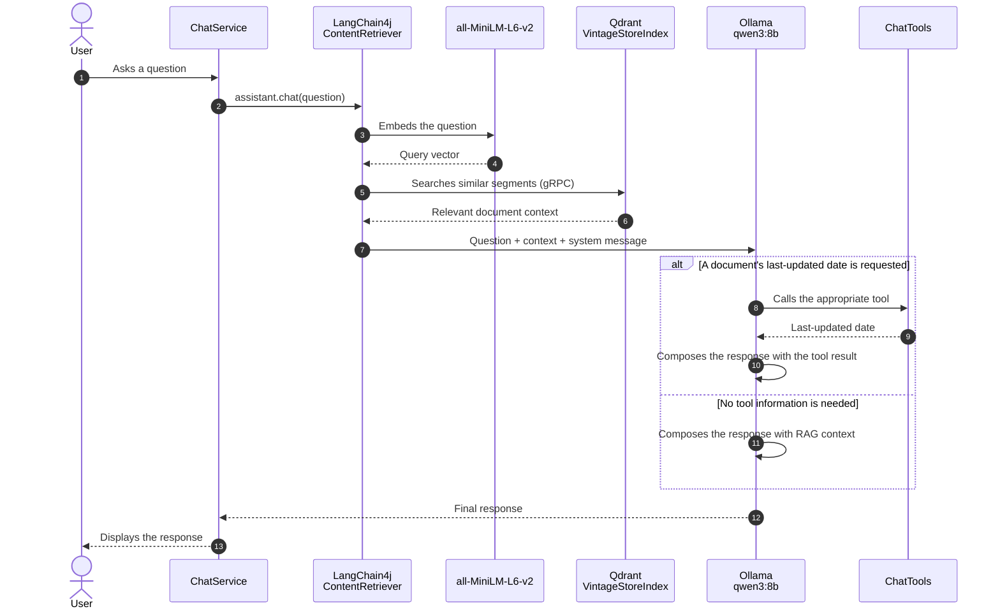

# Retroguide

Retrieval-Augmented Generation (RAG) conversational assistant for Vintage Store.
PDF documents are split into chunks, embedded with `all-MiniLM-L6-v2`, and indexed in
Qdrant. For each question, the assistant retrieves relevant context before generating a
response with a local Ollama model. The assistant can also call business tools to
retrieve the last-updated date of specific documents.

## Prerequisites

- Java 21
- Docker and Docker Compose

## Getting started

1. Start Ollama and the vector store you select:

   ```bash
   docker compose up -d ollama qdrant
   ```

   To use Infinispan instead of Qdrant, start its service:

   ```bash
   docker compose up -d ollama infinispan
   ```

   Its administration dashboard is available at
   [`http://localhost:11222/console/`](http://localhost:11222/console/) without a login.
   This configuration is intended for local development only: do not expose port `11222`
   on an untrusted network.

   Set the same vector store for ingestion and chat. For example:

   ```bash
   export EMBEDDING_STORE_PROVIDER=infinispan
   ```

   After changing the provider, run ingestion again because Qdrant and Infinispan store
   separate vector indexes.

2. Pull the default local chat model:

   ```bash
   docker compose exec ollama ollama pull qwen3:8b
   ```

   To use OpenAI instead, set `CHAT_MODEL_PROVIDER=openai` and `OPENAI_API_KEY` before
   starting the chat. Ollama is the default and does not require an API key.

3. Add the PDFs to index to the project, then run ingestion:

   ```bash
   mvn -P ingest compile exec:java
   ```

4. Start the chat:

   ```bash
   mvn compile exec:java
   ```

   Type `quit` to stop the application.

> Ingestion recursively scans `.pdf` files from the project directory and stores their
> vectors in the `VintageStoreIndex` Qdrant collection.

## Configuration

| Variable | Default | Description |
| --- | --- | --- |
| `CHAT_MODEL_PROVIDER` | `ollama` | Chat model provider: `ollama` or `openai`. |
| `OLLAMA_BASE_URL` | `http://localhost:11434` | Ollama server URL. |
| `OLLAMA_MODEL` | `qwen3:8b` | Pulled Ollama chat model to use. The model must support tool calling. |
| `OPENAI_API_KEY` | Required for `openai` | OpenAI API key. |
| `OPENAI_MODEL` | `gpt-4.1` | OpenAI chat model to use when `CHAT_MODEL_PROVIDER=openai`. |
| `EMBEDDING_STORE_PROVIDER` | `qdrant` | Vector store provider: `qdrant` or `infinispan`. |
| `QDRANT_URL` | `http://localhost:6334` | Qdrant gRPC endpoint when `EMBEDDING_STORE_PROVIDER=qdrant`. |
| `INFINISPAN_HOST` | `localhost` | Infinispan Hot Rod host when `EMBEDDING_STORE_PROVIDER=infinispan`. |
| `INFINISPAN_PORT` | `11222` | Infinispan Hot Rod port when `EMBEDDING_STORE_PROVIDER=infinispan`. |
## RAG sequence with tools



## Components

| Component | Role |
| --- | --- |
| `DocumentIngestor` | Parses PDFs, splits them into 2,000-character chunks with 200-character overlap, then indexes their embeddings. |
| `ChatService` | Initializes the assistant and provides the command-line chat interface. |
| Qdrant | Stores embeddings and retrieves the nearest chunks. |
| Ollama | Runs the local chat model. |
| `ChatTools` | Exposes the last-updated dates of policy and terms documents. |
