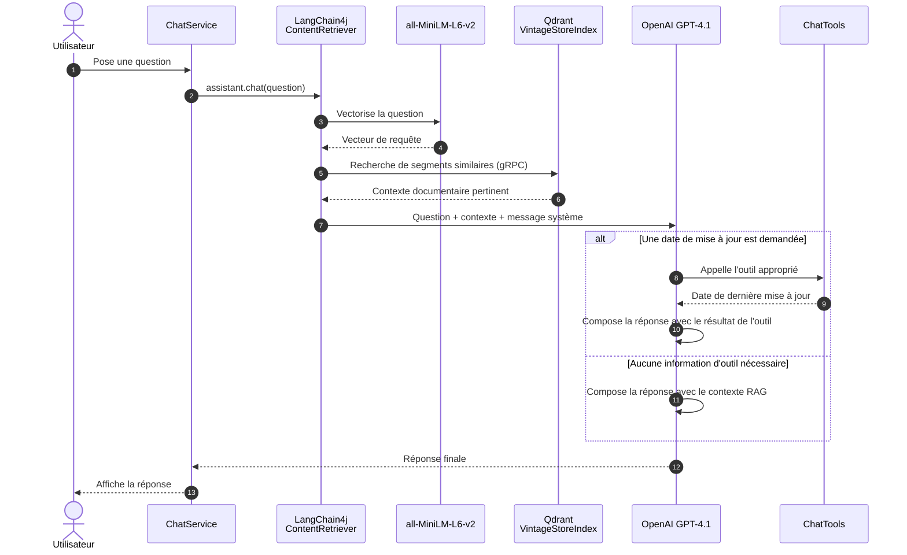

# Retroguide

Assistant conversationnel RAG (Retrieval-Augmented Generation) pour Vintage Store.
Les documents PDF sont découpés, vectorisés avec `all-MiniLM-L6-v2`, puis indexés dans
Qdrant. À chaque question, l'assistant récupère le contexte pertinent avant de générer
une réponse avec GPT-4.1. Il peut aussi appeler des outils métier pour connaître la date
de mise à jour de documents spécifiques.

## Prérequis

- Java 21
- Docker et Docker Compose
- Une clé API OpenAI dans la variable `OPENAI_API_KEY`

## Démarrage

1. Démarrer Qdrant :

   ```bash
   docker compose up -d qdrant
   ```

2. Ajouter les PDF à indexer dans le projet, puis lancer l'ingestion :

   ```bash
   mvn exec:java -Dexec.mainClass=me.akkhalef.document.DocumentIngestor
   ```

3. Configurer la clé OpenAI et démarrer le chat :

   ```bash
   export OPENAI_API_KEY="..."
   mvn exec:java
   ```

   Saisir `quit` pour arrêter l'application.

> L'ingestion parcourt récursivement les fichiers `.pdf` du répertoire du projet et
> stocke leurs vecteurs dans la collection Qdrant `VintageStoreIndex`.

## Séquence RAG avec outil



## Composants

| Composant | Rôle |
| --- | --- |
| `DocumentIngestor` | Parse les PDF, les découpe en segments de 2 000 caractères avec un chevauchement de 200, puis indexe leurs embeddings. |
| `ChatService` | Initialise l'assistant et fournit l'interface de chat en ligne de commande. |
| Qdrant | Stocke les embeddings et retrouve les segments les plus proches. |
| `ChatTools` | Expose les dates de mise à jour des documents de politique et conditions. |
