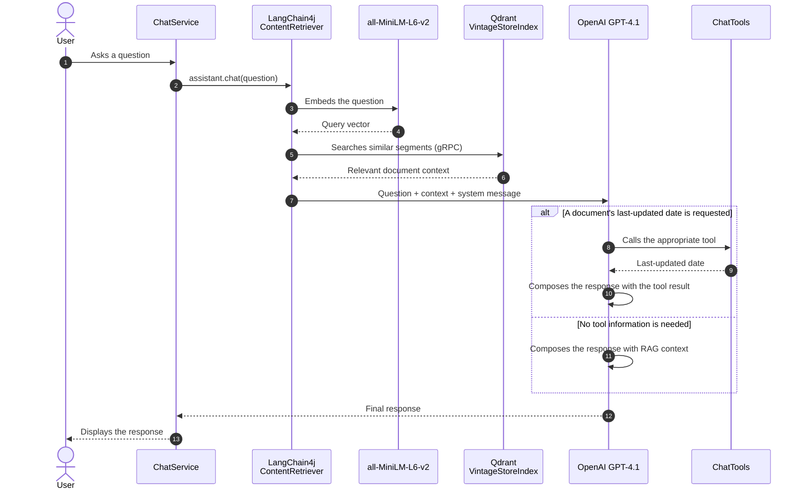

# Retroguide

Retrieval-Augmented Generation (RAG) conversational assistant for Vintage Store.
PDF documents are split into chunks, embedded with `all-MiniLM-L6-v2`, and indexed in
Qdrant. For each question, the assistant retrieves relevant context before generating a
response with GPT-4.1. It can also call business tools to retrieve the last-updated date
of specific documents.

## Prerequisites

- Java 21
- Docker and Docker Compose
- An OpenAI API key in the `OPENAI_API_KEY` environment variable

## Getting started

1. Start Qdrant:

   ```bash
   docker compose up -d qdrant
   ```

2. Add the PDFs to index to the project, then run ingestion:

   ```bash
   mvn exec:java -Dexec.mainClass=me.akkhalef.document.DocumentIngestor
   ```

3. Configure the OpenAI API key and start the chat:

   ```bash
   export OPENAI_API_KEY="..."
   mvn exec:java
   ```

   Type `quit` to stop the application.

> Ingestion recursively scans `.pdf` files from the project directory and stores their
> vectors in the `VintageStoreIndex` Qdrant collection.

## RAG sequence with tools



## Components

| Component | Role |
| --- | --- |
| `DocumentIngestor` | Parses PDFs, splits them into 2,000-character chunks with 200-character overlap, then indexes their embeddings. |
| `ChatService` | Initializes the assistant and provides the command-line chat interface. |
| Qdrant | Stores embeddings and retrieves the nearest chunks. |
| `ChatTools` | Exposes the last-updated dates of policy and terms documents. |
